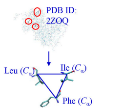

# TSR Key Generation


A Python package for generating Triangular Spatial Representation (TSR) keys from protein-chain pairs.

## Features
- Download PDB files for specified proteins.
- Generate TSR keys for analysis. 

## Installation

1. **Clone the repository**:
   ```bash
   git clone https://github.com/KrishnaRauniyar/TSR-Package.git
   cd TSR-Package

2. **Install the Package**:
   ```bash
   pip install .

3. **Run the Package**:
   ```bash
   ## For a single pdb input with a protein name and a chain information run the command below:
   tsrkeygeneration '[("3p45", "A")]'

   ## For multiple pdb input run the command as follows:
   tsrkeygeneration '[("3p45", "A"), ("3qnw", "A")]'

## Result
  You will see two folders created 
   - pdb_files (downloaded pdb)
   - proteins (TSR Keys) 
